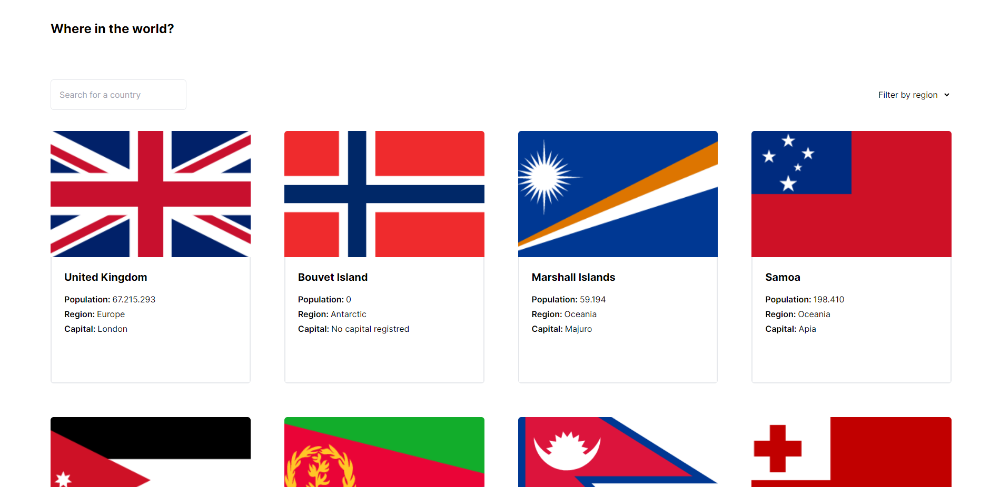

# REST Countries



This is a solution to the [REST Countries API challenge on Frontend Mentor](https://www.frontendmentor.io/challenges/rest-countries-api-with-color-theme-switcher-5cacc469fec04111f7b848ca). Frontend Mentor challenges help you improve your coding skills by building realistic projects. 

## Overview

## Status

- [x] Criar projeto com Vue + Vite + TS
- [x] Criar composables para reuso do fetch
- [x] Criar páginas
  - [x] Rota home
  - [x] Rota com detalhes do país
- [ ] Criar testes unitários
- [ ] Fazer deploy do projeto no Vercel

### The challenge

Your challenge is to integrate with the [REST Countries API](https://restcountries.com) to pull country data and display it like in the designs.

You can use any JavaScript framework/library on the front-end such as [React](https://reactjs.org) or [Vue](https://vuejs.org). You also have complete control over which packages you use to do things like make HTTP requests or style your project.

Your users should be able to:

- See all countries from the API on the homepage
- Search for a country using an `input` field
- Filter countries by region
- Click on a country to see more detailed information on a separate page
- Click through to the border countries on the detail page


### Links

- [Em desenvolvimento] Solution URL:
- [Em desenvolvimento] Live Site URL:

## My process

### Built with

- [Vue](https://vuejs.org/)
- [Typescript](https://www.typescriptlang.org/)
- [TailwindCSS](https://tailwindcss.com/)
- [Vitest](https://vitest.dev/)


### What I learned

Esse desafio me fez rever conceitos sobre fetch API e a utilização de boas práticas, como um composable para reuso de função fetch.
Além disso, a parte de filtrar os arrays foi um desafio lógico para mim,
pois precisava fazer a solução mais simples possível para o problema, e aqui está ela e como resolvi:


```typescript
function countriesFiltered() {
  if (filterByRegion.value !== "" || filterByName.value !== "") {
    return countries.value.filter((elem: any) => {
      /* O código abaixo pode parecer errado, mas por mais que esteja checando se inclui as letras,
      não há como formar o nome de um continente com as letras de outro, o que fez reduzir
      o tamanho do código */
      return (
        elem.region
          .toLowerCase()
          .includes(filterByRegion.value.toLowerCase()) &&
        elem.name.common
          .toLowerCase()
          .includes(filterByName.value.toLowerCase())
      );
    });
    //Se apenas o filtro por nome for ativado
  } else {
    return countries.value.filter(
      (_: unknown, id: number) => id <= cardsInView.value
    );
  }
}
```

## Author

[@leonardonicola](https://www.github.com/leonardonicola)
